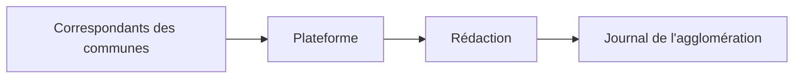
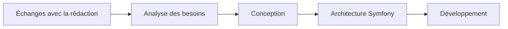
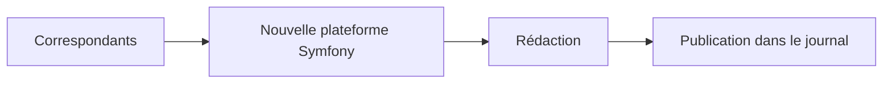

# Rapport de stage

Alès Agglomération - Marc MOSCA

---

# Alès Agglomération - Service communication

Collectivité territoriale regroupant 71 communes

 

### Mission

Informer les habitants du territoire à travers différents supports de communication.

 

### Support principal

- Journal de l'agglomération
- Site internet & Application mobile
- Réseaux sociaux

### Besoin

Collecter les informations provenant des différentes communes :

* événements
* manifestations
* activités locales

---

# Ma mission principale

Migrer la plateforme de Java JEE vers Symfony

 

### Objectifs

- Moderniser l'application
- Faciliter sa maintenance
- Répondre aux besoins actuels des utilisateurs

### Fonctionnement

 

---

# Un projet avec des contraintes particulières

Aucun accès à l'application existante

 

### Je n'avais pas :

❌ Le code source

❌ Un environnement de test

❌ Une documentation complète

### J'avais uniquement :

✅ Les utilisateurs

✅ Leurs retours

✅ Leurs besoins métier

---

# Analyse et conception

La démarche que j'ai utilisée pour réaliser le projet

 

 

### Analyse métier

* Compréhension des usages
* Identification des fonctionnalités

### Conception

* Architecture de l'application
* Modèle de données
* Interfaces utilisateur

---

# Développement et réalisation

De la conception au développement de l'application finale

 

  

### Développement

* Backend Symfony
* Base de données optimisée
* Fonctionnalités métier

---
layout: image-left
image: images/widget-elementor-settings.png
backgroundSize: contain
---

# Projet complémentaire - WordPress

Développement d'un widget Elementor personnalisé

Fonctionnalités :

* génération d'un sommaire automatique
* liste d'identifiants personnalisée
* scan automatique de la page
* navigation simplifiée

---

---

# Compétences développées

## Techniques

* Symfony
* PHP
* Doctrine
* WordPress
* Elementor
* Architecture web

## Professionnelles

* Autonomie
* Analyse des besoins
* Communication
* Gestion de projet
* Résolution de problèmes

---

# Ce que cette expérience m'a appris

### Au-delà du développement

* Comprendre les besoins des utilisateurs
* Concevoir une solution avant de coder
* Collaborer avec des profils non techniques
* Transformer un besoin métier en application concrète

---

# Merci pour votre attention

### Questions ?
