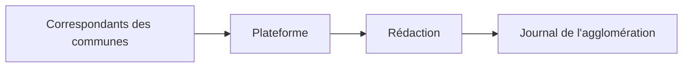
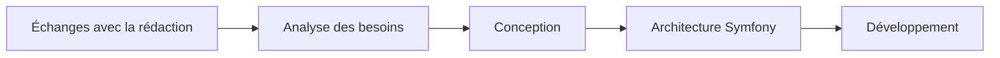
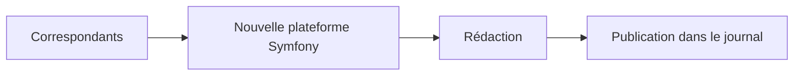

---
src: ./pages/alesagglo.md
---

---

# Fonctionnement de la plateforme

### Objectif

Centraliser les informations avant leur publication dans le journal.

---

# Ma mission

## Recréer entièrement la plateforme sous Symfony

### Objectifs

* Moderniser l'application
* Faciliter sa maintenance
* Répondre aux besoins actuels des utilisateurs

---

# Une contrainte majeure

## Aucun accès à l'application existante

### Je n'avais pas :

❌ Le code source

❌ Un environnement de test

❌ Une documentation complète

### J'avais uniquement :

✅ Les utilisateurs

✅ Leurs retours

✅ Leurs besoins métier

---

# Ma démarche

---

# Ce que j'ai réalisé

### Analyse métier

* Compréhension des usages
* Identification des fonctionnalités

### Conception

* Architecture de l'application
* Modèle de données
* Interfaces utilisateur

### Développement

* Backend Symfony
* Base de données
* Fonctionnalités métier

---

# Résultat final

### Application finalisée et utilisée

---

# Projet complémentaire

## Développement WordPress

### Widget Elementor personnalisé

Fonctionnalités :

* génération d'un sommaire automatique
* liste d'identifiants personnalisée
* scan automatique de la page
* navigation simplifiée

---

# Compétences développées

## Techniques

* Symfony
* PHP
* Doctrine
* WordPress
* Elementor
* Architecture web

## Professionnelles

* Autonomie
* Analyse des besoins
* Communication
* Gestion de projet
* Résolution de problèmes

---

# Ce que cette expérience m'a appris

### Au-delà du développement

* Comprendre les besoins des utilisateurs
* Concevoir une solution avant de coder
* Collaborer avec des profils non techniques
* Transformer un besoin métier en application concrète

---

# Merci pour votre attention

### Questions ?
