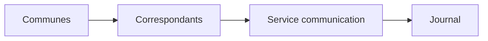
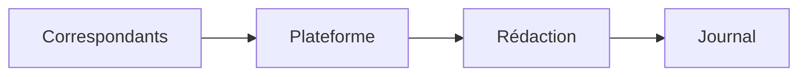
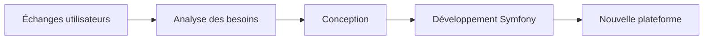

# Rapport de stage

Alès Agglomération - Stage de 6 mois - Service communication

---

# Présentation d'Alès Agglomération

Collectivité territoriale regroupant **71 communes**

Informer les habitants à travers :

* Le journal de l'agglomération
* Le site internet
* Les réseaux sociaux

Collecter les informations remontées par les communes :

* Événements
* Manifestations
* Activités locales

---

# Ma mission

Concevoir une nouvelle plateforme métier avec Symfony

### Objectifs :

* Moderniser l'application
* Faciliter sa maintenance
* Répondre aux besoins des utilisateurs

### Utilisateurs :

* Correspondants des communes
* Équipe de rédaction
* Service communication

---

# Un défi particulier

Au début du stage, je ne pouvais pas analyser l'application existante.

## Je ne disposais pas de

❌ Code source

❌ Environnement fonctionnel

❌ Documentation complète

## Pour avancer

✅ Échanges avec les utilisateurs

✅ Analyse des usages

✅ Compréhension des besoins métier

➡ Comprendre l'existant à travers les utilisateurs

---

# De l'analyse au développement

Le processus que j'ai utilisé pour concevoir la nouvelle plateforme

 

## Analyse & conception

* Identification des besoins
* Modélisation des données
* Architecture de l'application
* Interfaces utilisateur

## Développement

* Application Symfony
* Fonctionnalités métier
* Validation avec la rédaction
* Ajustements continus

---
layout: image-right
image: images/widget-elementor-settings.png
backgroundSize: contain
---

# Projet complémentaire

Création d'un widget Elementor permettant de générer automatiquement un sommaire.

 

### Fonctionnalités :

* Configuration manuelle
* Détection automatique des sections
* Génération des ancres
* Navigation simplifiée

 

### Objectif :

Améliorer l'expérience utilisateur sur les pages contenant beaucoup de contenu.

---

# Bilan du stage

Tout ce que j'ai appris au cours de mon stage

## Compétences techniques

* Symfony
* PHP
* WordPress
* Architecture web
* Conception d'applications

## Compétences professionnelles

* Autonomie
* Analyse des besoins
* Communication
* Gestion de projet
* Résolution de problèmes

## Ce que j'ai retenu

Comprendre les besoins des utilisateurs est aussi important que le développement lui-même.

---
layout: center
---

# Merci pour votre attention

Avez-vous des questions ?
